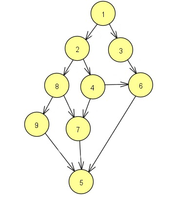
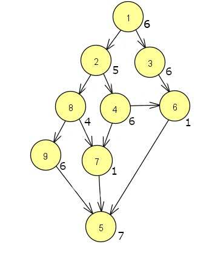
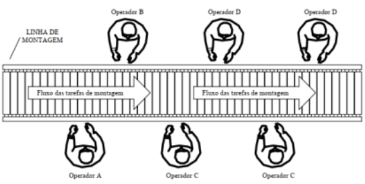

# Métodos de Otimização

Este projeto implementa métodos de otimização para resolver problemas práticos utilizando heurísticas gulosas. O objetivo é analisar dados, identificar requisitos e aplicar uma solução que minimize o custo total de execução. O projeto foi desenvolvido em Python.

## Introdução

Neste trabalho, está sendo usado uma heurística gulosa para obter uma solução do problema, onde podemos compreender para chegar em uma solução inicial. O objetivo é mostrar como é possível chegar a uma solução viável que, posteriormente, poderá ser refinada.

## Conteúdo 
### Heurística gulosa

A heurística gulosa é uma abordagem onde vamos pegar elementos candidatos para inserção dele no conjunto solução da seguinte forma:

- Conjunto candidato: Conjunto extraído dos arquivos dentro do data, que usaremos para criar a solução do problema.

- Seleção: Selecionamos um elemento e checamos a viabilidade dele.

- Viabilidade: Verificar se o elemento não fere suas precedências para entrar no conjunto solução.

- Função objetivo(FO): Atribuímos um valor de custo para a solução.

- Solução: Uma solução viável para o problema.

Existem alguns problemas clássicos resolvidos com esta heurísticas, como o problema da mochila, onde o objetivo é maximizar o valor dos objetos colocados em uma mochila. No entanto, a mochila tem tamanho limitado, então você precisa selecionar quais itens levara para maximizar o valor.

### Solução inicial
<div align="center">
    
    <figcaption>Figura 1 - Grafo De Prioridades</figcaption>
</div>

A Figura 1 mostra um grafo de prioridades, representando a ordem de execução das tarefas, onde cada número corresponde a uma tarefa e as arestas indicam precedência. Cada número representa uma tarefa e cada tarefa tem um custo atribuído a ela. Por enquanto, quero falar sobre a ordem de precedência: nenhuma tarefa pode ser concluída se sua antecessora não foi finalizada. Vamos considerar que começamos agora. Temos o elemento 2, que tem um antecessor. Enquanto ele não for concluído, a tarefa 2 não pode ser finalizada, e assim sucessivamente até chegar a um conjunto solução.

Assim, chegamos a uma solução inicial viável: [1, 2, 3, 4, 8, 6, 7, 9, 5]

<div align="center">
    
    <figcaption>Figura 2 - Grafo De Prioridades com custo</figcaption>
</div>

Aqui estão as tarefas, que são as mesmas do grafo anterior, mas com a representação do custo de cada elemento. Cada tarefa tem seu custo, representando sua função objetivo (FO) de 42, sendo este o custo total para a execução dessas tarefas. No entanto, ainda dividiremos as tarefas em várias máquinas, pois estamos lidando com uma linha de produção.

<div align="center">
    
    <figcaption>Figura 3 - Linha De Montagem</figcaption>
</div>

Visualizando a imagem, podemos ter uma noção de que cada operador será atribuído a uma certa quantidade de tarefas. Inicialmente, queremos melhorar a função objetivo (FO) atribuindo quantidades iguais de tarefas para cada um dos operadores.

#### Representação de maquinas:


##### Maquina não refinada:
```
Quantidade de maquinas: 5

Maquina normal: [1, 2]
Maquina normal: [3, 4]
Maquina normal: [8, 6]
Maquina normal: [7, 9]
Maquina normal: [5]   

Fo: 12
```
Aqui, inicialmente, temos uma solução onde o problema na linha de produção é resolvido. A função objetivo (FO) é calculada de forma um pouco diferente, considerando o custo mais alto entre todas as máquinas.

##### Maquina refinada:
```
Quantidade de maquinas: 5

Maquina refinada: [1]
Maquina refinada: [2, 3]
Maquina refinada: [4, 8, 6]
Maquina refinada: [7, 9]
Maquina refinada: [5]

Fo: 11

```
Após fazermos um refinamento usando a política de vizinhança, obtemos um valor melhor. Embora a diferença seja pequena, há uma melhora no elemento ao considerar a solução inicial.

A política de vizinhança implementada consiste em mover o último elemento, removendo-o da lista e alocando-o na primeira posição da lista inferior, e também fazendo o caminho contrário, sempre buscando o melhor valor possível para a função objetivo (FO).

